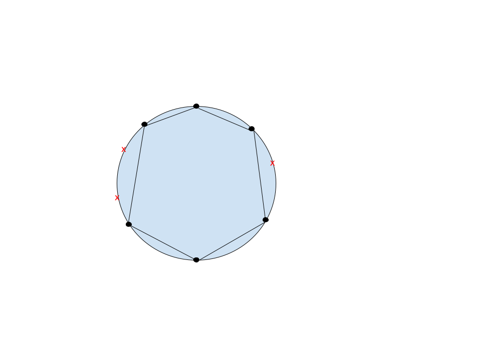

# Solutions of the Homework 1 - Francesco Ortu

## Ex 1

Let be $X$ the random variable that describe the time takes to travel home. $X$ has the following density function:

$$
f(x) = \begin{cases}
    1-\dfrac{x}{2} & x \in (0,2) \\
    0 & \text{otherwise}
\end{cases}
$$

Then let be $Y=8+12X$ the random variable that describe the cost of the trip. We will have

$$
\mathbb{E}(Y)=\mathbb{E}(8+12X)=8+12\mathbb{E}(X)= \\
= 8+12 \int_{0}^{2} x-\dfrac{x^2}{2} dx = 8 + 8 = 16
$$

## Ex 2
If $X,Y$ are indipendent than $Cor(X,Y)=0$. In fact,

$$
Cor(X,Y)=\mathbb{E}(X\cdot Y)-\mathbb{E}(X)\mathbb{E}(Y)=\mathbb{E}(X)\mathbb{E}(Y)-\mathbb{E}(X)\mathbb{E}(Y) = 0
$$

where I used that if $X$ and $Y$ are indipendent it holds that $\mathbb{E}(X\cdot Y)=\mathbb{E}(X)\mathbb{E}(Y)$.

Viceversa 

$$
Cor(X,Y)=0 \not \Rightarrow \text{$X$,$Y$ are indipendent }$$
For example let's consider $X$~$Unif([-1,-1])$ and $Y=X^2$ which are trivial dependent:

$$
Cor(X,Y)=\mathbb{E}(X^3)-\mathbb{E}(X)\mathbb{E}(X^2)=0-0\cdot\mathbb{E}(X^2)=0
$$

## Ex 3
The probability to compute is  

$$
\mathbb{P}(T\leq 3|T\geq2)=\dfrac{\mathbb{P}(2 \leq T\leq 3)}{\mathbb{P}(T\geq2)}= \dfrac{\int_{2}^{3}dx\frac{1}{5}e^{-\frac{x}{5}}}{\mathbb{P}(T\geq2)}= \dfrac{e^{-\frac{2}{5}}-e^{-\frac{3}{5}}}{e^{-\frac{2}{5}}}
$$

## Ex 4
The VC dimension of 
$$
H=\{\mathbf{1}_{x\in V}: V \text{ is a convex polytope in }\mathbb{R}^2\}
$$
is $\infty$. Suppose 
$\exists m\in \mathbb{N}$ 
such that $VCdim(H)=m$. Then, consider a set $C=\{c_1,\dots, c_{m+1}\}$ placed in a circle as shown in the figure below:   

 

It is always possible to construct a convex polytope that contains only the points of one class, simply taken the polytope which have as vertexes the points of the class choosed. Because that is true for any possible distribution of classes in $C$, must be $VCdim(H)= m+1$, which is absurd. 